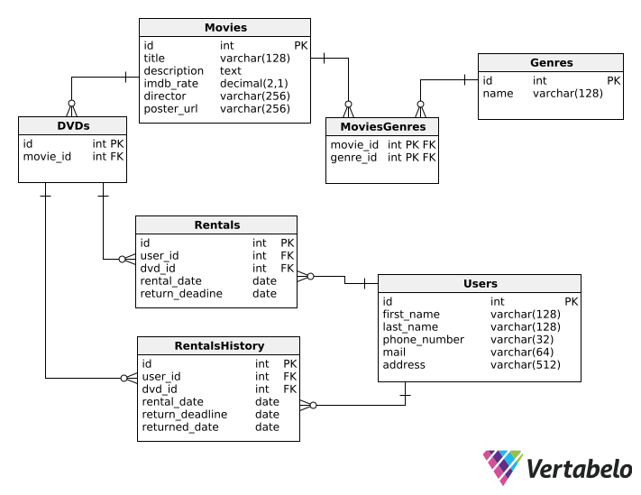

# Projekt Wypożyczalnia filmów

## Autorzy

- Kamil Kawula, kamilkawula@student.agh.edu.pl
- Krzysztof Ligarski, kligarski@student.agh.edu.pl

## Temat projektu

Tematem projektu będzie wypożyczalnia filmów w postaci płyt DVD.

## Informację o wykorzystywanym SZBD i technologii realizacji projektu

Planujemy wykorzystać bazę PostgreSQL, serwer Express.js z frontendem napisanym w React.js.

## Link do repozytorium

[https://github.com/taylor-swif/movie-rental](https://github.com/taylor-swif/movie-rental)

## Funkcje

- Dodanie użytkownika
- Przeglądanie bazy filmów
- Dodawanie egzemplarzy danego filmu
- Wypożyczenie egzemplarza
- Zwrot egzemplarza
- Raport nieoddanych w terminie filmów
- Raport wypożyczeń dla filmów w danym przedziale czasowym
- Raport wypożyczeń dla gatunków w danym przedziale czasowym

## Schemat bazy danych



## Endpointy API

Wszystkie enpointy zwracają kod 200 w przypadku sukcesu, 404 w przypadku nieznalezienia konkretnego rekordu oraz 500 w przypadku błedu serwera.

### Gatunki

#### `/genres`

##### GET

Zwraca listę gatunków postaci:

```json
[
  {
    "id": 1,
    "name": "Crime"
  },
  ...
]
```

##### POST

Umożliwia dodanie nowego gatunku. Należy przekazać gatunek w postaci:

```json
{
  "name": "New genre name"
}
```

Nowo dodany gatunek zostanie zwrócony wraz z nadanym mu ID.

#### `/genres/:id`

Parametr `:id` powinien być liczbą całkowitą odpowiadającą ID gatunku.

##### GET

Zwraca dane gatunku w postaci:

```json
{
  "id": 1,
  "name": "Crime"
}
```

##### PATCH

Umożliwia zmianę danych (nazwy) gatunku. Należy dostarczyć uaktualnione dane w postaci:

```json
{
  "name": "New genre name"
}
```

Uaktualniony gatunek zostaje zwrócony.

##### DELETE

Umożliwia usunięcie gatunku. W przypadku, gdy jakieś filmy należą do tego gatunku, ich powiązanie zostanie usunięte.

### Filmy

#### `/movies`

##### GET

Umożliwia znajdowanie filmów.

Można użyć poniższych parametrów zapytania:

- `availability=true` lub `availability=false` - umożliwia wyszukanie tylko filmów, które są dostępne lub są niedostępne (liczba dostępnych egzemplarzy DVD jest większa niż zero gdy `true` lub równa zero gdy `false`),
- `title=XYZ` - tytuł zawiera fragment `XYZ`, porównanie niewrażliwe na wielkość liter,
- `description=XYZ` - opis zawiera fragment `XYZ`, porównanie niewrażliwe na wielkość liter,
- `imdb_gte=X.Y` - ocena filmu jest większa bądź równa liczbie `X.Y`, np. `6.5`,
- `imdb_lte=X.Y` - ocena filmu jest mniejsza bądź równa liczbie `X.Y`, np. `6.5`,
- `director=XYZ` - imię i nazwisko reżysera zawiera ragment `XYZ`, porównanie niewrażliwe na wielkość liter.

Przykładowe użycie parametrów:
`/movies?director=Tarantino&imdb_gte=8.0`

```json
[
  {
    "id": 9,
    "title": "Pulp Fiction",
    ...
  },
  {
    "id": 7,
    "title": "Django Unchained",
    ...
  }
]
```

Dodatkowo, można wyszukać filmy, które należą do danego/kilku danych gatunków. Należy je dostarczyć w zapytaniu w postaci:

```json
{
  "genre_ids" = [...]
}
```

gdzie w miejsce `...` należy wpisać ID gatunków, np. zapytanie z poniższymi gatunkami:

```json
{
  "genre_ids" = [4, 5]
}
```

zwraca:

```json
[
  {
    "id": 2,
    "title": "Tenet",
    ...
  },
  {
    "id": 3,
    "title": "Interstellar",
    ...
  },
  {
    "id": 11,
    "title": "2001: A Space Odyssey",
    ...
  },
  {
    "id": 13,
    "title": "Lobster",
    ...
  }
]
```

##### POST

Umożliwia dodanie filmu. Należy go przekazać w postaci:

```json
{
  "title": "...",
  "description": "...",
  "imdb_rate": "X.Y",
  "director": "...",
  "poster_url": "..."
}
```

Nowo dodany film zostanie zwrócony wraz z nadanym mu ID.

#### `/movies/:id`

Parametr `:id` powinien być liczbą całkowitą odpowiadającą ID filmu.

##### GET

Umożliwia uzyskanie szczegółów danego filmu w postaci:

```json
{
  "id": X,
  "title": "...",
  "description": "...",
  "imdb_rate": "X.Y",
  "director": "...",
  "poster_url": "..."
}
```

##### PATCH

Umożliwia zmianę danych (nazwy) gatunku. Należy dostarczyć uaktualnione dane w postaci:

```json
{
  "title": "...",
  "description": "...",
  "imdb_rate": "X.Y",
  "director": "...",
  "poster_url": "..."
}
```

Nie trzeba podawać wszystkich parametrów.

Zwrócony zostaje uaktualniony film.

##### DELETE

Umożliwia usunięcie filmu. Jeżeli film był powiązany z jakimiś gatunkami, te powiązania zostaną usunięte.

#### /movies/:id/genres

Parametr `:id` powinien być liczbą całkowitą odpowiadającą ID filmu.

##### GET

Umożliwia uzyskanie listy gatunków, do którego należy dany film. Zostają zwrócone w postaci:

Przykład wywołania:
`/movies/3/genres`

```json
[
  {
    "id": 4,
    "name": "Sci-Fi"
  },
  {
    "id": 5,
    "name": "Adventure"
  }
]
```

#### /movies/:movie_id/genres/:genre_id

##### PUT

Umożliwia dodanie gatunku `genre_id` do filmu `movie_id`.

##### DELETE

Umożliwia usunięcie gatunku `genre_id` z filmu `movie_id`.

#### /movies/:movie_id/available

##### GET

Zwraca dostępne płyty dla filmu `movie_id`

Przykładowe użycie:
`/movies/7/available`

```json
[
  {
    "id": 18,
    "movie_id": 7,
    "rentable": true
  }
]
```

### Płyty

#### `/dvds`

##### GET

Zwraca listę wszystkich płyt w postaci:

Można użyć parametru zapytania:

- `movie_id=5` - zwraca płyty odpowiedniego filmu

```json
[
    {
        "id": 1,
        "movie_id": 1,
        "rentable": false
    },
    {
        "id": 2,
        "movie_id": 1,
        "rentable": true
    },
    ...
]
```

##### POST

Dodawanie płyty odpowiedniego filmu:

```json
{
  "movie_id": "X"
}
```

Nowo dodana płyta zostanie zwróca wraz z nadanym jej ID.

#### `/dvds/:id`

Parametr `:id` powinien być liczbą całkowitą odpowiadającą ID gatunku.

##### GET

Umożliwia uzyskanie szczegółów danej płyty:

```json
{
    "id": X,
    "movie_id": Y,
    "rentable": true/false
}
```

##### PATCH

Użliwia zmianę stanę płyty lub filmu na niej dostępnego

```json
{
    "movie_id": Y,
    "rentable": "true"
}
```

Nie trzeba podoawać wszystkich parametrów, zwrócona płyta jest uaktualniona.

##### DELETE

Usuwa płytę z bazy, jeżeli płytnia nie była wcześniej nigdy wypożyczona

### Uzytkownicy

#### `/users`

##### GET

Zwraca listę wszystkich użytkoników w postaci:

```json
[
    {
        "id": 1,
        "first_name": "Bernard",
        "last_name": "Arnault",
        "phone_number": "123456789",
        "mail": "berand@lv.com",
        "address": "931-947, Fifth Street 21, Dallas, California"
    },
    {
        "id": 2,
        "first_name": "Jeff",
        "last_name": "Bezos",
        "phone_number": "987654321",
        "mail": "mynameisjeff@aws.com",
        "address": "605-943, Fifth Street 18, San Antonio, Alaska"
    },
    ...
]
```

##### POST

Umożliwia dodanie użytwkonika do bazy. Należy go przekazać w postaci:

```json
{
  "first_name": "...",
  "last_name": "...",
  "phone_number": "123456789",
  "mail": "...@[provider].com",
  "address": "..."
}
```

#### `/users/:id`

Parametr `:id` powinien być liczbą całkowitą odpowiadającą ID użytkownika.

##### GET

Umożliwia uzyskanie danych szczególnego użytkownika.

##### PATCH

Umożliwia zmianę danych użytkownika. Należy dostarczyć uaktualnione dane w postaci:

Przykład aktualizacji dwóch parametrów:

```json
{
  "last_name": "...",
  "address": "..."
}
```

Nie trzeba podawać wszystkich parametrów.

Zwrócony zostaje uaktualniony film.

##### DELETE

Umożliwia usunięcie użytkownika z bazy, jezeli nigdy nie wypożyczył filmu.

### Wypozyczenia

#### `/rentals`

##### GET

Umożliwia znalezienie aktualnie wypożyczonych płyt.

Można użyć poniższych parametrów zapytania:

- `late=true` lub `late=false` - filtruje wypożyczenia, które nie zostały zwrócone przed określonym terminem, a także te, które nadal mają czas na zwrot.
- `user_id=X` - płyty wpożyczone przez użytkownika z danym ID
- `dvd_id=Y` - informacja o wypożyczeniu płyty z danym ID
- `movie_id=Z` - wypożycznia filmu z danym ID

Przykładowe użycie parametrów:
`/movies?movie_id=4`

```json
[
  {
      "id": 382,
      "user_id": 6,
      "dvd_id": 11,
      "rental_date": "2024-04-10",
      "return_deadline": "2024-05-24"
  },
  {
      "id": 383,
      "user_id": 6,
      "dvd_id": 13,
      "rental_date": "2024-03-25",
      "return_deadline": "2024-05-28"
  },
  ...
]
```

##### POST

Umożliwia wypożyczenie płyty jeżeli ta jest dostępna, w przeciwnym razie zostanie zwrócona informacja, że płyta nie jest dostępna.

```json
{
  "user_id": X,
  "dvd_id": Y,
  "return_deadline": "2077-04-20"
}
```

Zwracany zostaje wpis do tabeli wraz z nadanym ID oraz datą wypożyczenia.

```json
{
  "id": 378,
  "user_id": 3,
  "dvd_id": 5,
  "rental_date": "2024-03-30",
  "return_deadline": "2024-05-21"
}
```

#### `/rentals/:id`

Parametr `:id` powinien być liczbą całkowitą odpowiadającą ID użytkownika.

##### GET

Zwraca wypożyczenie o danym ID

##### PATCH

Umożliwia zmianę parametrów wypożczenia. Należy dostarczyć uaktualnione dane w postaci:

```json
{
  "user_id": X,
  "dvd_id": Y,
  "rental_date": "2024-03-30",
  "return_deadline": "2024-05-21"
}
```

Nie trzeba podawać wszystkich parametrów.

Zwrócony zostaje uaktualniony film.

##### DELETE

Delete służy do zwracania płyt, wpis jest usuwany z tabeli rentals oraz przenoszony do tabeli rentals_history wraz z datą zwrotu.

### Wypozyczenia historyczne

#### `/rentals_history`

##### GET

Umożliwia wgląd do historii wypożyczeń.

Można użyć poniższych parametrów zapytania:

- `late=true` lub `late=false` - filtruje wypożyczenia, które nie zostały zwrócone przed określonym terminem, a także te, które nadal mają czas na zwrot.
- `user_id=X` - płyty wpożyczone przez użytkownika z danym ID
- `dvd_id=Y` - informacja o wypożyczeniu płyty z danym ID
- `movie_id=Z` - wypożycznia filmu z danym ID

```json
[
  {
    "id": 1,
    "user_id": 3,
    "dvd_id": 1,
    "rental_date": "2020-07-13",
    "return_deadline": "2020-08-08",
    "returned_date": "2020-08-06"
  }
]
```

#### `/rentals_history/:id`

##### GET

Zwraca wpis z historii wypożyczenia o danym ID.

### Raport filmów

#### `/movies_report`

##### GET

Ten endpoint generuje raport na temat filmów, zwraca liczbę wypożczeń w danym okresie czasu

Można użyć poniższych parametrów zapytania:

- `rental_before="2024-06-20"`
- `rental_after="2024-01-01`

```json
[
  {
    "id": 1,
    "title": "Oppenheimer",
    "description": "The story of American scientist J. Robert Oppenheimer and his role in the development of the atomic bomb.",
    "imdb_rate": "8.3",
    "director": "Christopher Nolan",
    "poster_url": "https://fwcdn.pl/fpo/28/17/10002817/8120472_1.6.jpg",
    "rentals": 18
  },
  {
    "id": 5,
    "title": "Fight Club",
    "description": "An insomniac office worker and a devil-may-care soap maker form an underground fight club that evolves into much more.",
    "imdb_rate": "8.8",
    "director": "David Fincher",
    "poster_url": "https://fwcdn.pl/fpo/08/37/837/7549908.6.jpg",
    "rentals": 9
  },
  ...
]
```

### Raport gatunków

#### `/genres_report`

##### GET

Ten endpoint generuje raport na temat gatunków, zwraca liczbę wypożczeń w danym okresie czasu

Można użyć poniższych parametrów zapytania:

- `rental_before="2024-06-20"`
- `rental_after="2024-01-01`

```json
[
  {
    "id": 5,
    "name": "Adventure",
    "rentals": 132
  },
  {
    "id": 4,
    "name": "Sci-Fi",
    "rentals": 154
  },
  {
    "id": 10,
    "name": "History",
    "rentals": 64
  },
  ...
]
```

### Views

<!-- TODO -->

### Funkcje

<!-- TODO -->
